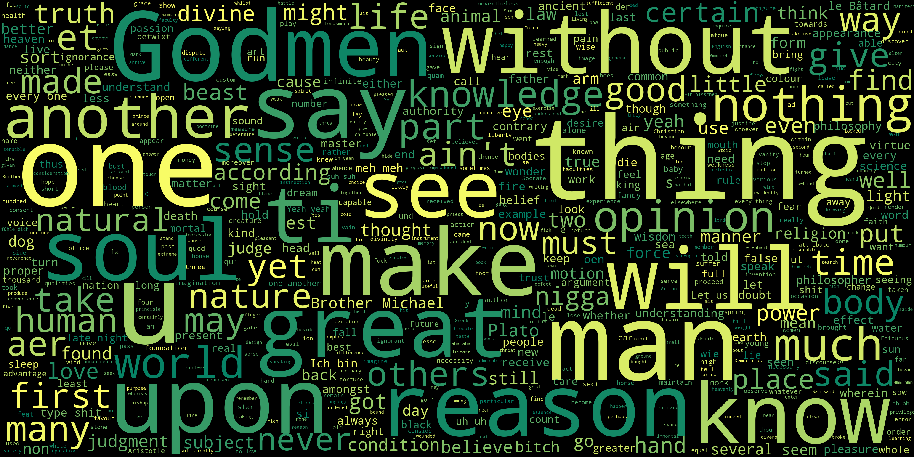

# SoundCloud Lyrics Wordcloud

This project allows you to collect song lyrics using the Genius API and generate a wordcloud from them. 
It provides one main script, `main.py` and the `cloud.py` script which can be used independently, but is also used by the `main.py`.

Below you can see the output given the sample `songs.csv`, I think its quite interesting so see.  
*Uh uh. Suh suh. Mhh Mhh. Yeah Yeah.*

## Usage

1. Make sure you have Python 3.12 installed on your system.

2. Obtain a Genius API token by following the instructions on the [Genius API website](https://genius.com/api-clients).

3. Create a CSV file named e.g. `songs.csv` and populate it with a list of songs and their respective artists. You can get your top 50 most streamed songs from a website like [Stats for Spotify](https://www.statsforspotify.com/) and paste them into the CSV file (manually adjust formatting).

4. Run the `main.py` script to collect the song lyrics using the Genius API and generate a wordcloud (use `--create_cloud` flag).

6. Enjoy exploring the wordcloud generated from the song lyrics! You can adjust its properties in the `cloud.py`.

> Note: Make sure that the artists and song names in the `songs.csv` file do not contain commas. If they do, enclose the field in double quotes to escape the commas.

## Requirements

- Python 3.12
- Genius API token
- List of songs and their artists in a CSV file

## Getting Started

1. Clone this repository to your local machine.

2. Install the required dependencies by running `pip install -r requirements.txt`.

3. Follow the usage instructions mentioned above to collect song lyrics and generate a wordcloud.
